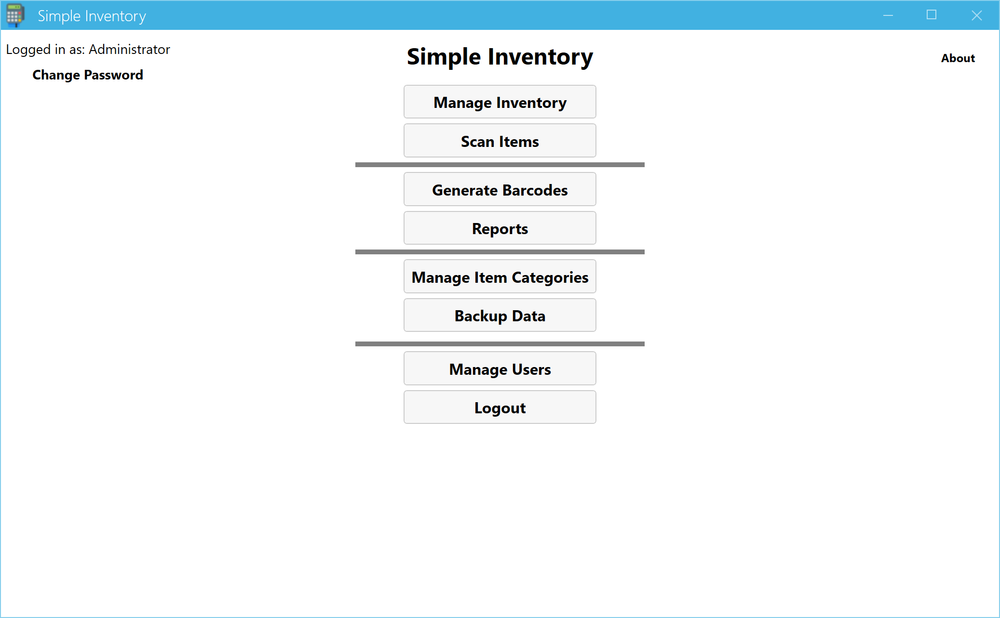
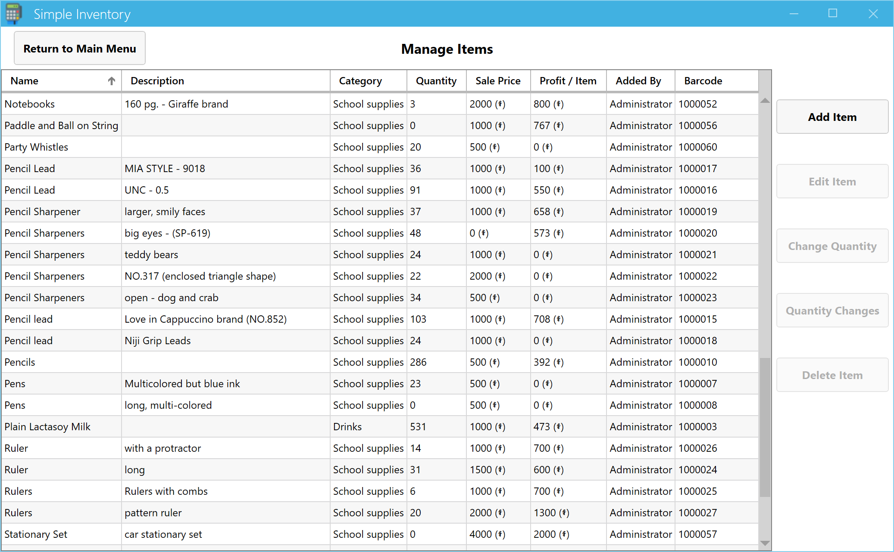
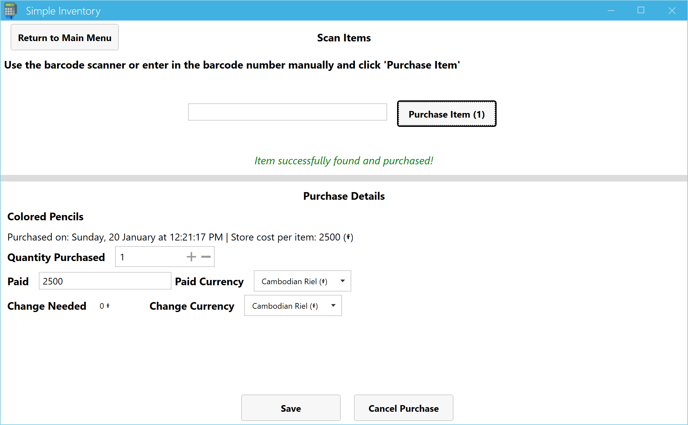
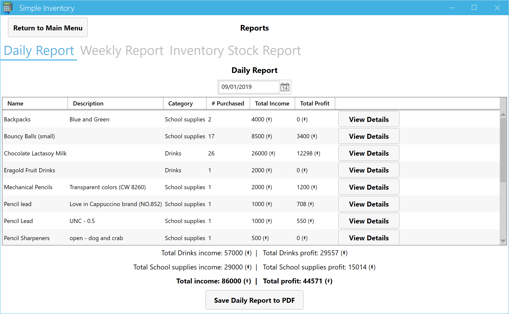

# SimpleInventory

SimpleInventory is a small Windows 7+ WPF software application to manage small inventories/stores where items are purchased on a regular basis. It runs on the .NET 4.7.1 framework and uses a SQLite database for data storage. SimpleInventory was built for a small school in Mondulkiri, Cambodia for use in the school store. Because of the school's location, Riel is the default currency, and A4 is the default paper size.

SimpleInventory can be edited in Visual Studio 2017+.

Feature set:

* Multiple users, each of which can be set with different permissions for the different software features available
* Manage your current inventory, including current stock/quantity
* Sort your inventory into different categories (drinks, school supplies, etc.) -- these different categories then show up as different subtotals on reports
* Scan items in using a barcode scanner to quickly mark items as sold
* When purchasing items, you can set the quantity purchased and amount paid, and the software calculates the amount of change you need to give -- including into different currencies
  * Note: modifying currencies doesn't have a UI yet but is easy to do from a SQLite editor
* Generate PDFs of barcodes to print out for use with your barcode scanner
* Run daily or weekly reports to see how much income you generated, how many items were sold, and how much profit you made
* Run inventory reports to see how much was in stock on any given date
* View details on when items were sold or when the quantity of an item was adjusted down to the second

## Default username and password

The default username is `admin`, and the default password is `changeme`. Please change the password before you use this in real life!

## Screenshots

## What sorts of things would be nice to add?

* UI for adding and editing currencies
* Search field on inventory screen
* More reporting capabilities?
* Capability to make one purchase with multiple items and designate who purchased it (makes it more like a point of sale system) -- would need to be able to turn this feature on/off
* Settings to change default paper size, date format, etc. throughout the app

### Code enhancements

* Use LINQ or similar to clean up the manual SQLite database calls
* Use a templated interface for creating an item (e.g. `ICreatedUser`) instead of one interface per type

## Can I help contribute?

Glad you asked! There are always things that can be done on an open-source project: fix bugs, add new features, and more! Check out the issues tab of this repository and take a look at what bugs have been reported and which features have been requested. If you'd like to request a feature or file a bug, by all means, please do so!

## Special Thanks

* The icon for this software was created by [Icons8](https://icons8.com) and is their Point of Sale Terminal icon. Thank you! :)
* Success sound by grunz: https://freesound.org/people/grunz/sounds/109662/
* Failure sound by Joe Lamb : http://soundbible.com/1830-Sad-Trombone.html

## License

MIT License. Thanks for using the software!